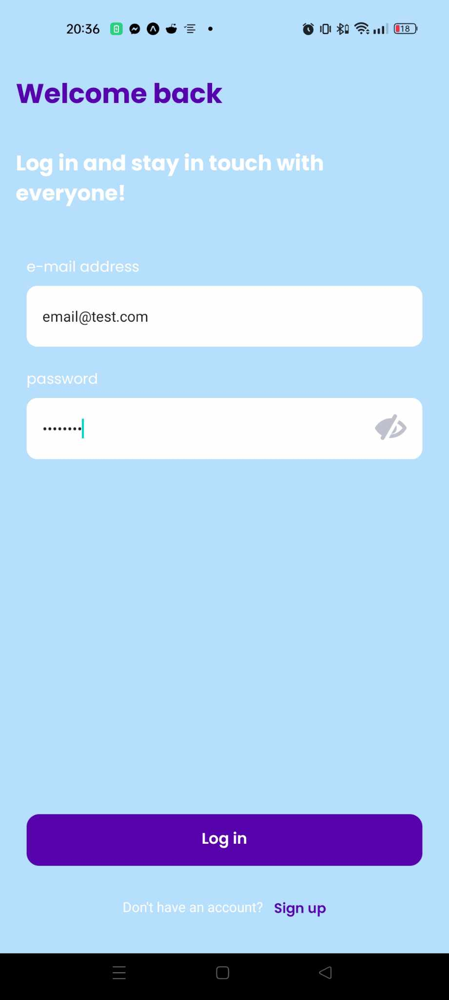

# Chattly
Simple ReactNative chat application with websockets and GraphQL.

## Built with

## Features
- Sign in on your existing account ✅
- Display list of chat rooms ✅
- Open chat and browse messages history ✅
- See if other user is typing or has sent message recently ✅
- Screens are protected, unauthorized user can't access chats ✅
- Error handling ✅

## Gallery

## Config
Backend url can be changed by setting `REACT_APP_WS_URL` and `REACT_APP_HTTP_URL` envs.
